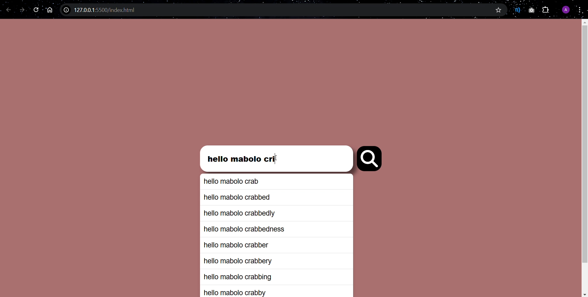

# Autocomplete Search Bar
---
## Project Title and Description
**Autocomplete Search Bar**  
This project is an interactive search bar with autocomplete functionality. It dynamically provides search suggestions as the user types, making it ideal for applications that require fast and efficient text searches. Unique features include prefix, suffix, and infix search suggestions, with a priority for frequently searched terms.

## Screenshot


## Table of Contents
1. [Project Title and Description](#project-title-and-description)
2. [Table of Contents](#table-of-contents)
3. [Installation and Setup](#installation-and-setup)
4. [Usage](#usage)
5. [Configuration](#configuration)
6. [Features](#features)
7. [Architecture or Code Structure](#architecture-or-code-structure)
8. [Contributing](#contributing)
9. [Testing](#testing)
10. [FAQ](#faq)

## Installation and Setup
1. **Clone the repository**:  
      ```bash
      git clone https://github.com/Abhinashroy/AutoCompleteSearchBar
      ```
2. **Dependencies**:
   - Ensure you have a compatible C++ compiler (e.g., g++).
   - A web server for running the `index.html` (e.g., Live Server in VS Code).

3. **Setup Instructions**:
   - Compile the C++ backend by running:
     ```bash
     g++ Final.cpp -o server -lws2_32
     ```
   - Start the C++ application as a backend server by running:
      ```bash
     ./server
     ```
   - Open `index.html` in a browser to view the UI(Using LIVE SERVER extension).

## Usage
1. **Run the Autocomplete Feature**:
   - Open `index.html` in a web browser.
   - Type in the search bar to see autocomplete suggestions dynamically appear.
   
2. **C++ Console Usage**:
   - Run `./server` from the terminal.
   - Enter words or search terms to see the autocomplete functionality in action.

3. **Server Communication**:
   - If server-based, ensure the server is running on `http://localhost:8080`, where JavaScript fetch requests will be sent for suggestions.

## Configuration
- **Configuring Backend URL**: Modify the URL in `script.js` if the backend server URL changes.
- **Environment Variables**: Ensure any necessary variables (like server URL) are updated in the JavaScript file or terminal commands as per the setup.

## Features
- **Autocomplete Suggestions**: Provides dynamic suggestions based on prefix, suffix, and infix searches.
- **Frequent Search Priority**: Frequently searched terms appear at the top of suggestions.
- **Keyboard Navigation**: Use arrow keys to navigate suggestions and enter to select.
- **Customizable Word List**: Easily modify the text file in Final.cpp (line 250) to change the dataset of words used for suggestions.
  

## Architecture or Code Structure
- **Frontend** (`index.html`, `style.css`, `script.js`):
  - **HTML**: Contains the main UI structure for the search bar and suggestions.
  - **CSS**: Styles the search bar, buttons, and suggestion items.
  - **JavaScript**: Handles input events, fetch requests, and manages suggestion display and user interactions.

- **Backend** (`Final.cpp`):
  - Handles the search logic to provide suggestions based on prefix, suffix, and infix terms.
  - Manages frequently searched terms for prioritized suggestions.

## Authors
1.[Varchasva Raj Saxena](https://github.com/Varchasva-Raj-Saxena)</br>
2.[Anmol Yadav](https://github.com/AnmolYadav1301)</br>
3.[Abhinash Roy](https://github.com/Abhinashroy)</br>
4.[Deepanshu ](https://github.com/DeepanshuPayal123)

---
## FAQ
1. **How do I change the server port?**  
   Update the `fetch` URL in `script.js` to the new server port.
   
2. **Why are suggestions not appearing?**  
   Ensure the backend server is running and accessible at the configured URL.
   
3. **How can I change the word list used for   suggestions?**
   In Final.cpp, go to line 250 where the program loads the text file containing all the words. Replace this file with your custom list of words to update the suggestions.
